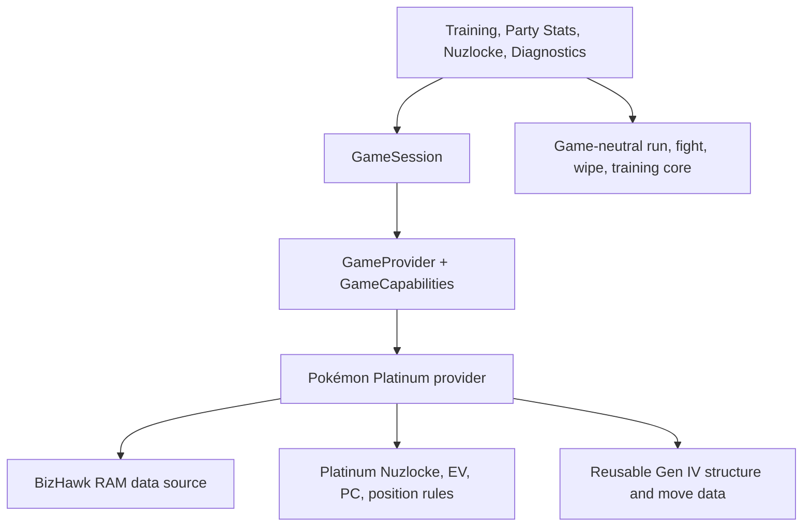

# Game integration boundary

The application resolves one `GameProvider` through `get_game_provider(game_id)` and
holds it with the data source in a small `GameSession`. The provider declares
capabilities before UI actions are enabled. An unknown game resolves to an
unsupported provider that does not start a RAM reader.

`games/provider.py` defines capability and theme descriptors and the provider
contract. `games/registry.py` resolves installed providers. The only registered
game is Pokémon Platinum. Its `games/platinum/provider.py` composes existing
decoders, catalogs, classifiers, PC layout constants, and coordinate tools; it
does not copy their implementations. `pokemon/gen4` remains the shared home
for generation-specific structures and move metadata. Nuzlocke lifecycle,
fight projection, wipe observation, and training decisions remain game-neutral.

The UI imports no `games.platinum` module directly. MainWindow still contains
the established Gen IV diagnostic text and detailed PC discovery workflow.
Those sections are capability-gated and use the active provider's services and
PC layout. This compatibility boundary keeps the proven Platinum inspection
tools intact without pretending another game's RAM layout is supported.

The `GameTheme` descriptor supplies accent and motif metadata to the shell.
Semantic success, warning, and danger colors remain separate from game skin
values. A future game can provide a different descriptor without changing
run status colors.

## Add a game integration

1. Define provider metadata: game ID, display name, generation, platform, emulator, and theme.
2. Supply a live party source and decoder, or leave `live_party` unsupported.
3. Declare each `GameCapabilities` flag independently; never enable an unimplemented reader.
4. Supply a generation move catalog when `move_metadata` is enabled.
5. Optionally supply an opponent reader and EV-yield lookup.
6. Optionally supply friendship rules and a Friendship Walk transport.
7. Optionally supply a Nuzlocke profile and acquisition classifier.
8. Optionally supply a PC storage adapter and layout.
9. Register the provider in `games/registry.py`.
10. Add provider, capability, UI, stream safety, and game-specific regression tests.

No second game is currently supported. A new provider must also be exercised
against the existing MainWindow diagnostic adapters before its live capability
flags are enabled.
